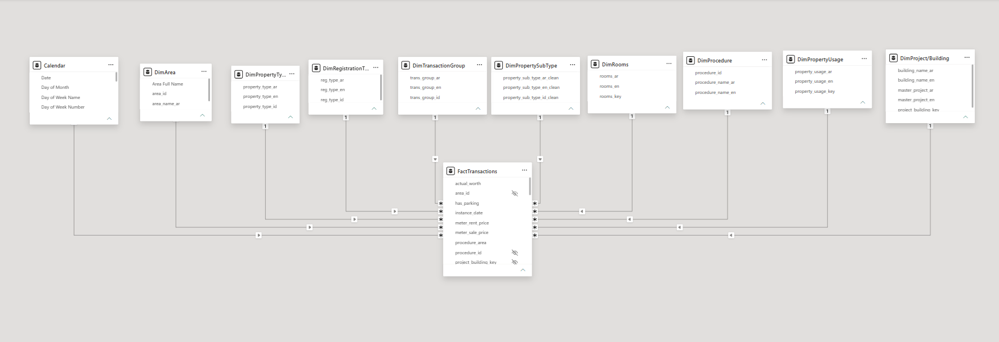
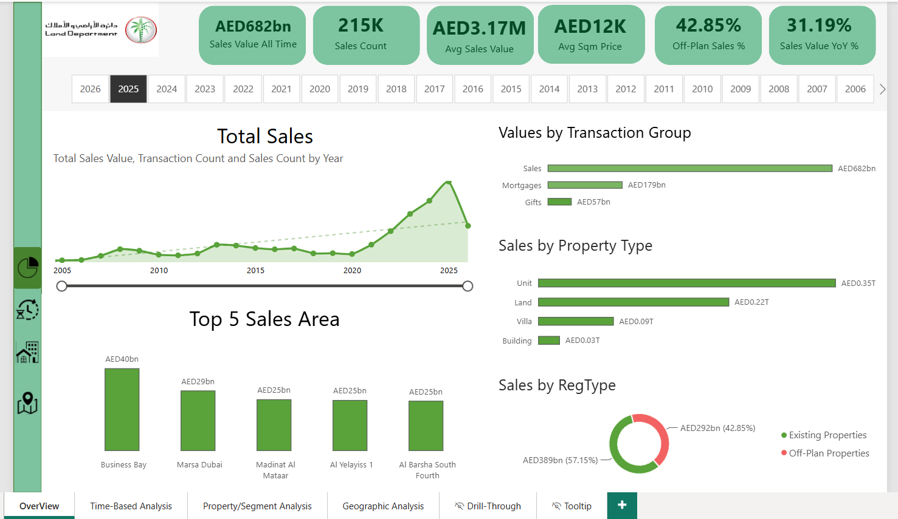
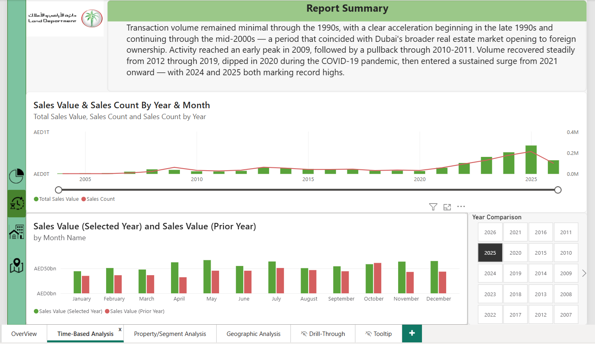
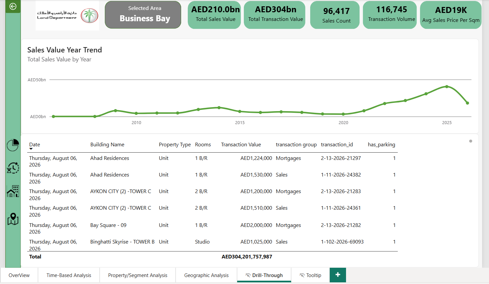
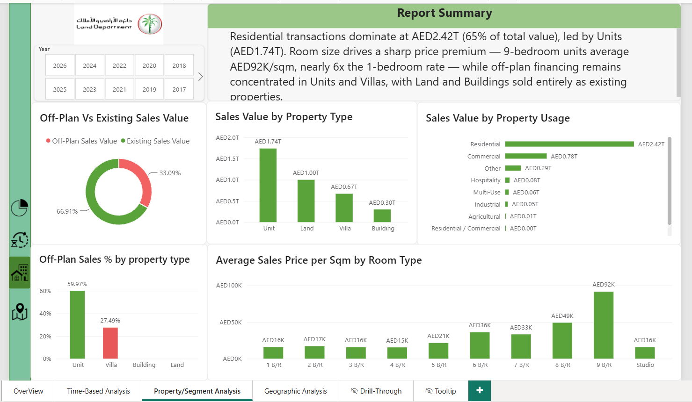
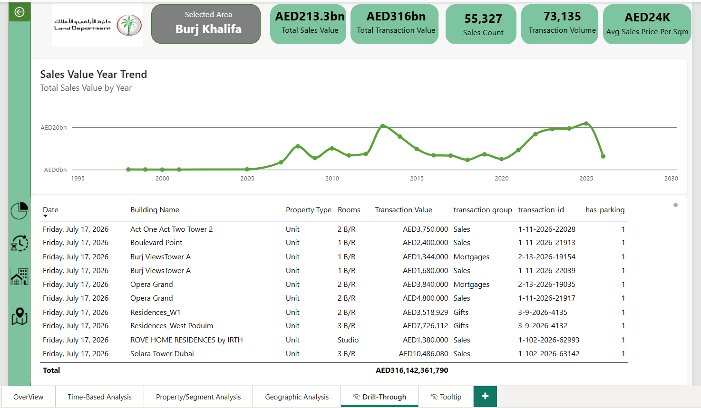
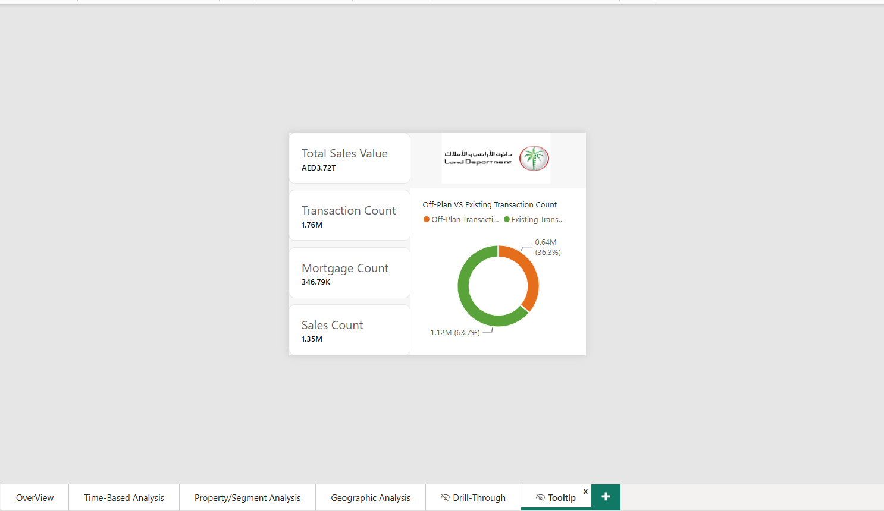

# Dubai Real Estate Transactions Dashboard

An end-to-end Power BI project analysing ~1.75 million Dubai Land Department real
estate transaction records (1966– July 17, 2026), built on DLD's public open dataset
([data.dubai](https://data.dubai)).

Star schema data modelling, extensive Power Query data cleaning, 25+ DAX measures,
geographic and time-based analysis, drill-through and custom tooltip pages — built
to demonstrate practical BI skills applied to a real, messy, large-scale dataset.

🔗 **[Live Dashboard](https://app.powerbi.com/view?r=eyJrIjoiYTg1NzAxM2MtNWY5Ni00OWZiLThlMjctNzIzZmZjZjk2OTE4IiwidCI6ImZjY2ExNDBiLWQwMzItNDhlMC1hMTc0LTZkYjNhNTkxOWZlMyIsImMiOjh9)**

---

## Files

| File | Description |
|------|--------------|
| `DLD_Real_Estate_Dashboard.pbix` | Full Power BI file — data model, Power Query transformations, DAX measures, and all report pages |
| `documentation/data_model_documentation.md` | Detailed data model architecture, data quality findings, and modelling decisions |
| `documentation/key_findings_and_recommendations.md` | Condensed summary of market insights and recommendations |
| `screenshots/` | Page-by-page screenshots plus the data model view |

---

## The Dataset

**Star schema — 1 fact table, 9 dimension tables + 1 date table**

| Table | Description |
|-------|-------------|
| `Fact_Transactions` | One row per transaction — value, area, property type, dates, and foreign keys to every dimension |
| `Dim_Area` | Geographic area/community |
| `Dim_Procedure` | Registration procedure type |
| `Dim_PropertyType` | Unit, Villa, Building, Land |
| `Dim_PropertySubType` | Flat, Office, Shop, Warehouse, and more — with data-quality backfill for Villa records |
| `Dim_RegistrationType` | Existing Properties vs Off-Plan Properties |
| `Dim_TransactionGroup` | Sales, Mortgages, Gifts |
| `Dim_Rooms` | Studio through 9-bedroom, plus non-residential categories |
| `Dim_PropertyUsage` | Residential, Commercial, Industrial, and more |
| `Dim_Project/Building` | Combined master project + building dimension with a drill-down hierarchy |
| `Calendar` | Date table (1966–2026), marked as the model's official date table for time intelligence |

**Volume:** ~1.75M transaction rows, model optimised from 1GB+ of raw source CSVs down to a ~57.5MB deployable file.

### Model View

---

## Dashboard Pages

**Overview**
Headline KPIs, all-time sales trend, transaction group and property type composition, top 5 areas by value.

**Time-Based Analysis**
Monthly/yearly trend with transaction count overlay, year-over-year month-by-month comparison.

**Geographic Analysis**
Top 20 areas matrix with conditional formatting, geocoded map of transaction activity across Dubai.

**Property/Segment Analysis**
Property type and usage composition, average price by room type, off-plan share by property type.

**Drill-Through**
Area-level detail page — scoped KPIs, historical trend, and transaction-level table.

**Tooltip**
Custom hover card showing scoped KPIs and off-plan/existing composition for the Top 5 Areas chart.

---

## Key Findings

- **Market Growth** — Transaction activity remained minimal through the 1990s, accelerating from the late 1990s onward alongside Dubai's real estate market opening to foreign ownership. Volume peaked in 2009, pulled back through 2010–2011, recovered steadily through 2019, dipped in 2020, and surged to record highs in 2024 and 2025.
- **Geographic Concentration** — Marsa Dubai leads both total sales value and transaction volume among all areas; Burj Khalifa commands the highest price per sqm, nearly double the group average.
- **Property Composition** — Residential transactions dominate at 65% of total value. Price scales sharply with unit size — 9-bedroom units average nearly 6x the 1-bedroom rate per sqm.
- **Off-Plan vs. Existing** — Off-plan financing applies to 60% of Unit sales and 27% of Villa sales, while Land and Building transactions occur almost exclusively as existing-property sales.

Full findings and recommendations: [`documentation/key_findings_and_recommendations.md`](documentation/key_findings_and_recommendations.md)

---

## Data Quality Highlights

- Standardised missing/unknown values across all dimension keys using a consistent "-1 / Unknown" convention rather than leaving them blank.
- Corrected cross-language contamination in the property usage field (English text appearing in Arabic values and vice versa) by cross-referencing the reliable sibling column.
- Backfilled missing sub-type classification for Villa records, verified against existing populated records before applying.
- Identified and excluded a small number of records with implausible transaction dates consistent with unconverted Hijri calendar years.

Full data model documentation, including every modelling decision and the reasoning behind it: [`documentation/data_model_documentation.md`](documentation/power_bi_model_documentation.md)

---

## Power Query & DAX Techniques Used

- Star schema design with a single unloaded shared query (`Transactions_Raw`) feeding every fact and dimension table, so cleaning logic is written once and inherited everywhere
- Surrogate key generation for dimensions without a native ID, with a standardised sentinel value for unknown/missing records
- Cross-column data correction (property usage field) using a reliable sibling column as the source of truth
- Time intelligence DAX — `SAMEPERIODLASTYEAR`, `DATESYTD`, year-over-year and year-to-date growth measures
- Weighted vs. simple average price measures, calculated and compared deliberately to avoid outlier distortion
- `RANKX` for dynamic Top-N ranking visuals
- Drill-through and report-page tooltips configured for area-level exploration
- Geocoding workaround for hyper-local area names via a composite "Area Full Name" column (area + city + country) set to the Place data category

---

## Tools

- Power BI Desktop
- Power Query (M)
- DAX
